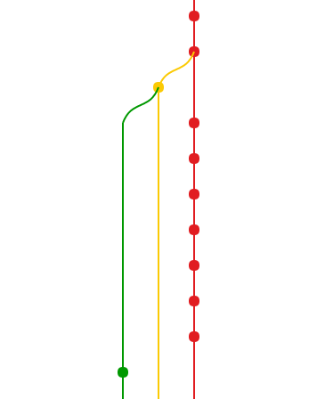
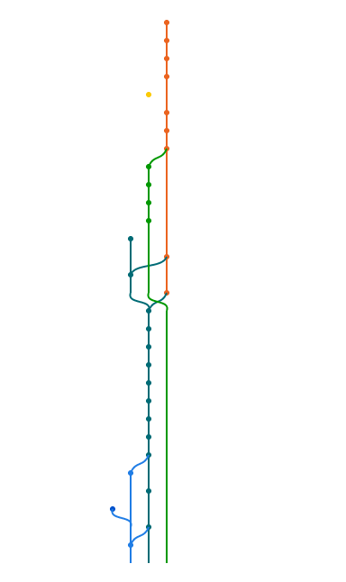

# commits-graph

A git commits graph widget using HTML5/Canvas.
Provide a jQuery plugin which make it easy to use.

*inspired by bitbucket*

## Demo

1. [Here](http://oct.tclh123.com/commits-graph/) is a pure HTML5+JS version, which hosted by github pages.
2. [Demo](https://github.com/tclh123/commits-graph/tree/master/demo) is a python version, which shows how I get preformatted data.

    To run it, you should install [libgit2](https://github.com/libgit2/pygit2) first, and then install all python dependencies through `pip install -r demo/requirements.txt`.
    Finally, you can `./tools/run_demo.sh`.

    Try visit,
    - http://localhost:8887
    - http://localhost:8887/?{path}
    
    where {path} denotes the absolute path to your local git repository.

## Options

All of the options have defaults and are not required for execution of the script. (See `demo/` for example)

* `height|width: 600` - Input the desired height|width of the canvas in pixels.
* `orientation: "horizontal"|"vertical"` - Allows the user to plot the graph either horizontally or vertically.
* `x_step|y_step: 20` - Select the step sizes of the graph, i.e. how many pixels between branches and commits.
* `dotRadius: 3` - Specify the radius in pixels of the commit dots.
* `lineWidth: 2` - Specify the width of the lines in pixels.

## FAQ

1. How do you get preformatted data to draw this graph?

    see `git/` & `demo/`.

2. What's the input data format?

    The graph data is composed of an **array of nodes**.
    As documented in the commits_graphy.py, each node is formatted as follows:

    ```
    [
        sha, //Commit hash
        [offest, branch], // Dot (offest: x-position, branch: branch no.)
        [
            [from, to, branch], // Route 1 (from: x-position, to: x-position of y+1, brach: branch no.)
            [from, to, branch], // Route 2
            [from, to, branch],
        ] // Route array
    ]
    ```

3. How does the graph been drawn?

    It loops through the node array and draws from the top, one level by one level. For each iteration, it draws a     dot(a commit) and the lines(the branches) require to the next level.
    
    For example, 
    
    
    
    The above graph is represented as 

    ```
    [
    commit1, [0,0], [[0,0,0]],
    commit2, [0,0], [[0,0,0], [0,1,1]],
    commit3, [1,1], [[0,0,0], [1,1,1], [1,2,2]],
    commit4, [0,0], [[0,0,0], [1,1,1], [2,2,2]],
    ...
    ]
    ```

    Branch 0: Red
    Branch 1: Yellow
    Branch 2: Green
    y{n}: n represent the offest of y
    x{n}: n represent the offest of x
    
    Iteration 1 - commit1
    - Draw a dot (offest: x{0} y{0}, Branch: 0)
    - Draw a line (from: x{0} y{0}, to: x{0} y{1}, Branch: 0)
    - Move painter to y{1}
    
    Iteration 2 - commit2
    - Draw a dot (offest: x{0} y{1}, Branch: 0)
    - Draw a line (from: x{0} y{1}, to: x{0} y{2}, Branch: 0)
    - Draw a line (from: x{0} y{1}, to: x{1} y{2}, Branch: 1)
    - Move painter to y{2}
    
    Iteration 3 - commit 3
    - Draw a dot (offest: x{1} y{2}, Branch: 1)
    - Draw a line (from: x{0} y{2}, to: x{0} y{3}, Branch: 0)
    - Draw a line (from: x{1} y{2}, to: x{1} y{3}, Branch: 1)
    - Draw a line (from: x{1} y{2}, to: x{2} y{3}, Branch: 2)
    - Move painter to y{3}
    
    Iteration 4 - commit 4
    - Draw a dot (offest: x{0} y{3}, Branch: 0)
    - Draw a line (from: x{0} y{3}, to: x{0} y{4}, Branch: 0)
    - Draw a line (from: x{1} y{3}, to: x{1} y{4}, Branch: 1)
    - Draw a line (from: x{1} y{3}, to: x{2} y{4}, Branch: 2)
    - Move painter to y{4}


## Preview



## License

http://tclh123.mit-license.org/
